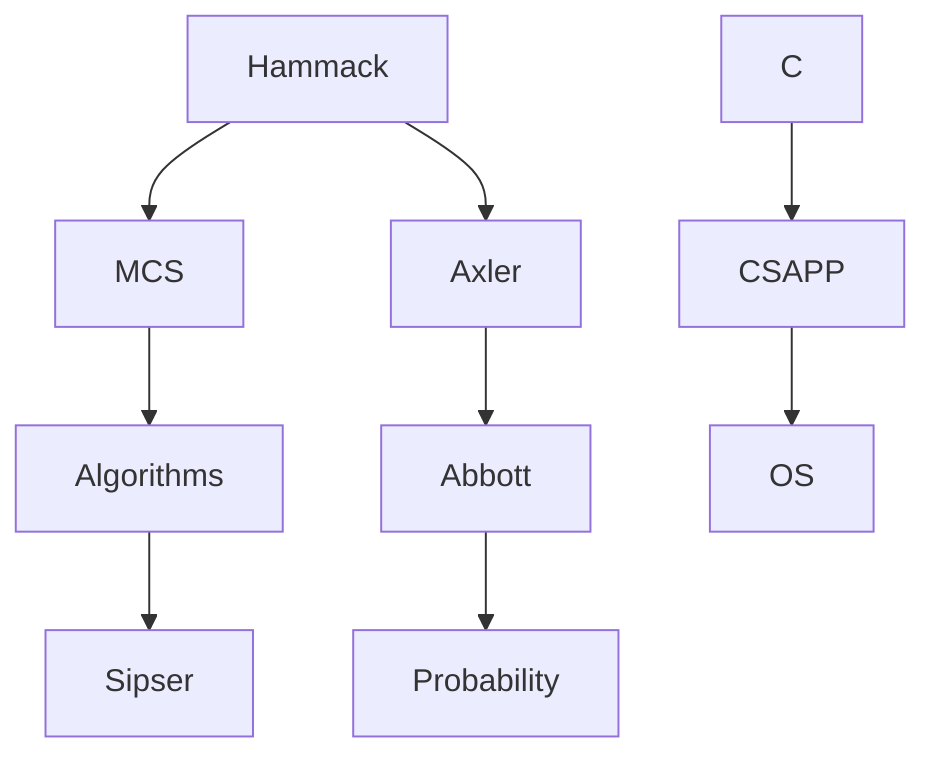

## 蓝图必须是活的，否则只是又一个文件夹 {#why-living}

《现代数学 × 现代 CS 长期自学路线蓝图》写在 Markdown 里，若从不更新，它会和网上复制的课表一样——**与你无关**。活文档（living document）的核心承诺是：

> 每学完一门课、一章、一个项目，你不只打勾，而是更新**掌握证据、薄弱点、项目产物、与下一阶段先修关系**。

六年里，你的活文档应比原始蓝图**更个人、更诚实、更具体**。它记录的不是「世界标准路线」，而是「**我的地图此刻长什么样**」。

本文给出：活文档推荐结构、文件组织、更新节奏、与系列前九篇工具的整合、版本化习惯、以及示例片段。

## 活文档 vs 笔记 vs 错题本 {#distinctions}

| 类型 | 目的 | 更新频率 |
| --- | --- | --- |
| 错题本 | 单题 Redo 与漏洞 | 每次做题 |
| 章节笔记 | 定义与定理存档 | 每章（可选） |
| 掌握证据 | 六级自评与能做什么 | 每章/每概念 |
| 项目日志 | 实现与实验 | 每次 lab |
| **活文档** | **全局地图、优先级、先修、年度方向** | 每周/每月/每课结束 |

活文档是**元层**：它不替代错题本，但汇总错题本指向的**战略决策**（「分析漏洞大，推迟拓扑」）。

## 推荐目录结构 {#structure}

在笔记仓库或本博客仓库旁建 `learning-map/`（名称随意）：

```text
learning-map/
├── README.md              # 北极星问题 + 当前阶段一句话
├── pillars.md             # 四根柱子状态
├── timeline.md            # 五年节拍个人版（可延期）
├── mastery/               # 掌握证据
│   ├── proof-discrete.md
│   ├── linear-algebra.md
│   ├── analysis.md
│   └── ...
├── projects/              # 项目日志链接或副本
│   ├── malloclab.md
│   └── tiny-compiler.md
├── cross-review/          # 双轨交叉回顾
│   └── 2026-W35.md
├── pitfalls-log.md        # 误区记录与纠正规则
└── archive/               # 已完成课程快照
    └── hammack-2026.md
```

不必一次建全；从 `README.md` + 一个 `mastery/` 文件开始。

## README.md：北极星与当前焦点 {#readme}

```markdown
# 我的现代数学 × CS 地图

## 北极星问题（抄自系列 01）
- 什么是证明？…
- 什么是计算？…

## 当前阶段（2026-Q3）
- 节拍：地图第 1 年
- 本周焦点：Hammack Ch8 + malloclab v0.2
- 暂停：不开范畴论

## 四柱健康度（1-5 自评）
| 柱 | 健康 | 备注 |
|----|------|------|
| 证明离散 | 4 | 归纳扎实 |
| 连续数学 | 3 | Axler 特征值进行中 |
| 算法理论 | 3 | K&T 图算法 |
| 系统 | 2 | malloc 卡点 coalesce |

## 下月里程碑
- [ ] Abbott 开 Ch1
- [ ] malloc 通过 driver 70%
```

每周日更新「本周焦点」；每季度更新「阶段」与「健康度」。

## pillars.md：四根柱子的掌握汇总 {#pillars}

链接到 `mastery/` 各文件，并写**柱级结论**：

```markdown
# 四根柱子状态

## 证明与离散
- 主教材：Hammack（Ch1-10 完成，Ch11 进行中）
- 整体 Level：多数 Ch Level 3，归纳 Level 4
- 薄弱：strong induction 在图论应用
- 下一动作：MCS 图论 Ch + Redo #23

## 连续数学
...
```

**柱健康度 <3 时**，活文档应触发**回补计划**，而非在 `timeline.md` 硬写下一年科目。

## timeline.md：个人五年节拍 {#timeline}

复制蓝图五年表，加三列：**计划 / 实际 / 状态**。

```markdown
| 年 | 数学计划 | 数学实际 | CS 计划 | CS 实际 | 状态 |
|----|----------|----------|---------|---------|------|
| Y1 | 证明线代离散 | 证明✓ 线代△ 离散△ | DS CSAPP | DS✓ CSAPP△ | 进行中，预计 Y1 延长 3 月 |
| Y2 | 分析概率抽代 | 未开始 | 算法 OS | — | 待 Y1 柱≥3 |
```

允许**延期**，不允许**假装按时**。

## mastery/：掌握证据库 {#mastery}

每概念一块（系列第六篇模板）。文件名按学科。示例 `mastery/linear-algebra.md`：

```markdown
# 线性代数掌握证据

## Vector Space (2026-08)
Level 1-3 ✓ | 4 △ | 5 ✗ | 6 △
证据：独立证明 subspace intersection；口试 span 未做
Redo：basis extension 标 R2

## Eigenvalues (2026-09)
...
```

**搜索友好**：用标题 `## Concept Name`，便于 grep。

## projects/：与系列第七篇对齐 {#projects}

每个项目 `PROJECT.md` 复制或链接到 `learning-map/projects/`。活文档 README 列出**活跃项目 ≤2**。

项目结束时移入 `archive/`，写 10 行复盘，更新柱健康度（如 malloc 完成 → 系统柱 +1）。

## cross-review/：双轨交叉 {#cross-review}

每周一条（系列第八篇）：

```markdown
# 2026-W35 交叉回顾
- 数学：等价关系
- CS：Union-Find 实现
- 连接：partition 与连通分量
- 下周对齐：MCS 概率 + hash 期望
```

## pitfalls-log.md：误区与个人规则 {#pitfalls}

记录你**反复犯**的误区（系列第九篇）：

```markdown
## 2026-09 又想买范畴论书
- 触发：看到推文
- 规则：Y4 前不买；先完成 Pinter
- 结果：未购买 ✓
```

## 更新节奏：日/周/月/季/课 {#cadence}

| 周期 | 更新内容 | 时间 |
| --- | --- | --- |
| 每日（可选） | 时间账单 | 2 min |
| 每周 | 焦点、交叉回顾、Redo 状态 | 15 min 周日 |
| 每月 | 柱健康度、误区日志、里程碑勾选 | 30 min |
| 每季 | timeline 实际列、下季主旋律 | 45 min |
| 每课结束 | archive 快照、mastery 汇总、先修图 | 1～2 h |

**每课结束**指：Hammack 全书、CSAPP 一阶段、malloc 项目完成等。

## 课程结束快照 archive {#archive}

`archive/hammack-2026.md`：

```markdown
# Hammack 完成快照 2026-06

## 覆盖范围
Ch1-12 全习题核心完成率 85%

## 六级抽样
- 归纳法：L4
- 反证法：L3
- 关系：L3

## 仍薄弱
- 部分组合证明 R2

## 对地图影响
- 证明柱升至 4
- 允许加大 MCS 带宽
- 先修：可正式开 Abbott 并行

## 产物链接
- 错题本 export
- 白纸测试扫描
```

快照防止「学完就忘自己学过什么」，也为几年后回顾提供证据。

## 先修关系图：个人版 {#prereq-graph}

用 Mermaid 或 bullet 维护**你的**先修，而非学校官方：



节点旁注 **Level 要求**：例如 `Abbott --> Topology` 标「需 Abbott L3+ 且 Axler L3+」。

当你发现拓扑吃力，回溯图找漏洞节点，在活文档写**回补边**（虚线）。

## 与 Git 版本化 {#git}

建议 `learning-map/` 进私有 Git 仓库：

- 每周 commit「W35 更新」；
- 重要快照打 tag `hammack-done-2026`；
- 不回溯删历史——诚实记录延期比美化 log 重要。

若用本博客仓库，可放 `content/private-learning/` 并 `.gitignore`（若不想公开）；或纯本地。

## 活文档如何驱动决策 {#decisions}

决策规则示例：

1. **开新书**：柱健康度均 ≥3，且活跃教材 <4；
2. **开 HoTT**：timeline Y4+ 且 逻辑/拓扑/范畴 archive 存在；
3. **选方向**：Y5 前在 README 写「主挖 PL / Systems」；
4. **回补周**：任一柱 <2 连续一月 → 下月回补主题。

活文档是**规则引擎**，减少每周意志力决策。

## AI 辅助维护 {#ai}

可让 AI：

- 根据 mastery 文件生成口试；
- 根据 pitfalls-log 提醒模式；
- **不要**让 AI 编造掌握证据——证据必须来自你的 Redo 与 lab。

提示词：

> 阅读我的 learning-map/README.md 和 mastery/linear-algebra.md，指出与「第一年四柱」不一致的地方，并建议下周 3 个具体动作。不要泛泛鼓励。

## 完整示例：学完 Hammack 后的一周 {#example-week}

**周一**：写 `archive/hammack-2026.md`；更新 `pillars.md` 证明柱。

**周二**：改 `timeline.md` Y1 数学列；在 `README` 加「Abbott 并行启动」。

**周三**：建 `mastery/analysis.md` 空模板；Abbott Ch1 第一条证据。

**周四**：`pitfalls-log` 写「曾想跳过 Velleman」→ 决定 Ch12 后刷 Velleman 选章。

**周五**：更新先修图；MCS 带宽加大。

**周日**：交叉回顾 + 季度里程碑勾选。

## 活文档腐烂的信号 {#rot}

- README 焦点 8 周未改；
- mastery 无新条目 1 月+；
- timeline 实际列全空；
- 项目日志无 commit 记录；
- 柱健康度全是 5（自欺）。

腐烂时执行系列第九篇**急救包**，不要新建「更完美」的文档系统——**更新现有 README 一行**即可重启。

## 与原始蓝图的关系 {#blueprint}

保留 `现代数学与现代CS_长期自学路线蓝图.md` 为**参考母版**，不动或极少动。所有个人延期、跳过、加深写在 `learning-map/`。**母版 + 子版**分离，避免把个人挫折写进「标准答案」里破坏信心，也避免标准答案绑架个人节奏。

## 行动清单 {#action}

1. 创建 `learning-map/README.md`，抄北极星问题；
2. 写四柱健康度初评（诚实）；
3. 建第一个 `mastery/*.md`；
4. 日历重复「周日 15min 活文档更新」；
5. 读完系列后，回到博文主文，链到本目录。

## 结语：地图与你一起变老 {#closing}

六年后期，你会翻开第一年的 archive，笑自己曾以为「读完 = 学会」——那笑里有证据，有 Redo 的痕迹，有 malloc 第一次 segfault 的日志。活文档是那张地图的**修订历史**。它不保证你不迷路，但保证迷路后，你知道自己从哪条路走来，下一步该回补哪一块，而不是从零焦虑。

系列十篇至此完结。回到 [系列索引](/docs/learning-rhythm/)，或 [主博文](/blog/modern-math-cs-learning-rhythm/)，开始你本周的第一条掌握证据。
